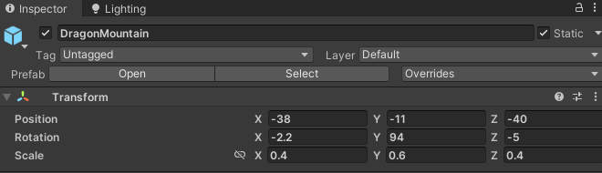
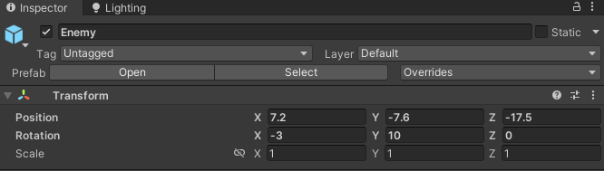
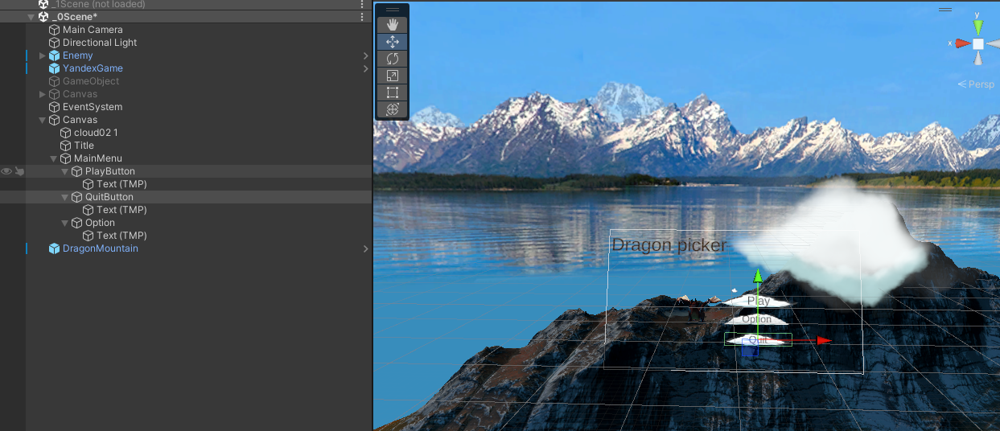
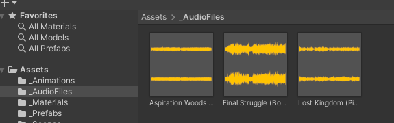
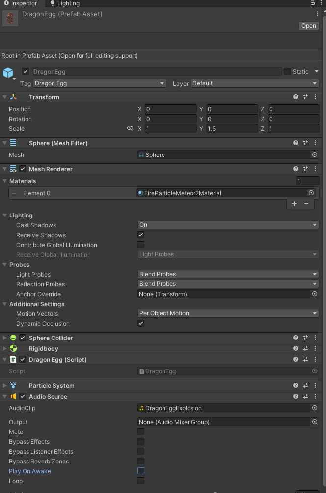
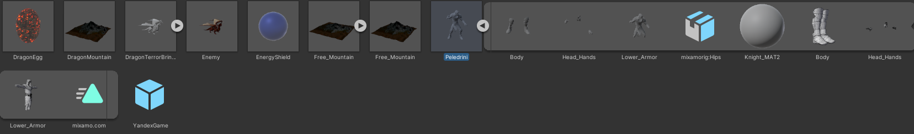
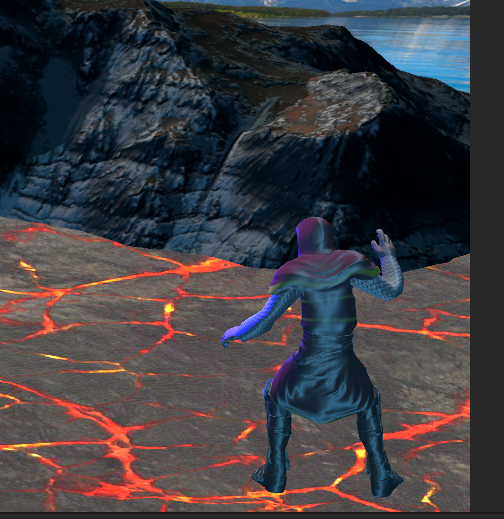
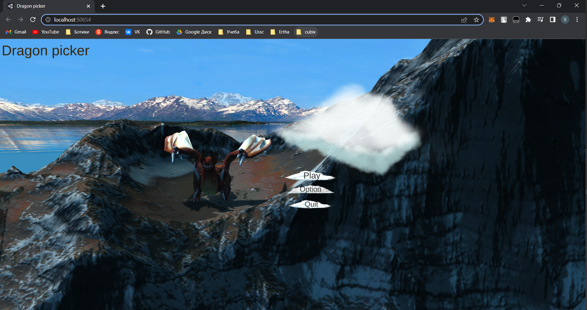

# Лабораторная работа №4 Доработка интерактивного приложения и его подготовка к сборке
Отчет по лабораторной работе №4 выполнил:
- Строшков Артем Валерьевич
- РИ-300004

Отметка о выполнении заданий (заполняется студентом):

| Задание | Выполнение | Баллы |
| ------ | ------ | ------ |
| Задание 1 | * |  |
| Задание 2 | * |  |
| Задание 3 | # |  |

знак "*" - задание выполнено; знак "#" - задание не выполнено;

Работу проверили:
- к.т.н., доцент Денисов Д.В.
- к.э.н., доцент Панов М.А.
- ст. преп., Фадеев В.О.

[](https://nodesource.com/products/nsolid)

[](https://travis-ci.org/joemccann/dillinger)

Структура отчета

- Данные о работе: название работы, фио, группа, выполненные задания.
- Цель работы.
- Задание 1.
- Код реализации выполнения задания. Визуализация результатов выполнения (если применимо).
- Задание 2.
- Код реализации выполнения задания. Визуализация результатов выполнения (если применимо).
- Задание 3.
- Код реализации выполнения задания. Визуализация результатов выполнения (если применимо).
- Выводы.
- ✨Magic ✨

## Цель работы
Подготовить разрабатываемое интерактивное приложение к сборке и публикации.

## Задание 1
### Используя видео-материалы практических работ 1-5 повторить реализацию приведенного ниже функционала:
### – 1 Практическая работа «Создание анимации объектов на сцене»
### – 2 Практическая работа «Создание стартовой сцены и переключение между ними»
### – 3 Практическая работа «Доработка меню и функционала с остановкой игры»
### – 4 Практическая работа «Добавление звукового сопровождения в игре»
### – 5 Практическая работа «Добавление персонажа и сборка сцены для публикации на web-ресурсе»

#### Ход работы (задание 1).
1) Переименовать текущую сцену("_1Scene") и добавить сцену "_0Scene"
2) Из новой сцены удаляем "Ground" и "Score", отключаем скрипт от камеры, отключаем скрипт от "Enemy"(Дракона)
3) Меняем transform горы
 


4) Меняем transform дракона



5) Добавить дракону анимацию
6) Добавить новый asset для анимарованных облаков, добавить облака на сцену
7) Создать и добавить облаку анимацию
8) Добавить заголовок игры на сцену
9) Соpдать Main Menu



10) Написать скрипт для начала игры и выхода

```cs

    using UnityEngine;
    using UnityEngine.SceneManagement;
    public class MainMenu : MonoBehaviour
    {
        public void PlayGame(){
            SceneManager.LoadScene(SceneManager.GetActiveScene().buildIndex + 1);
        }

        public void QuitGame(){
            Application.Quit();
        }
    }

```

11) Подключить скрипт к кнопкам меню
12) Создать и настроить меню опций(настроек)
13) Добавить возможность паузы игры на пробел и выход на esc

```cs

    using UnityEngine;
    using UnityEngine.SceneManagement;

    public class Pause : MonoBehaviour
    {
        private bool paused = false;
        public GameObject panel;
        void Update()
        {
            if (Input.GetKeyDown(KeyCode.Space)){
                if(!paused){
                    paused = true;
                    Time.timeScale = 0;
                    panel.SetActive(true);
                }
                else {
                    Time.timeScale = 1;
                    paused = false;
                    panel.SetActive(false);
                }
            }

            if(Input.GetKeyDown(KeyCode.Escape)){
                SceneManager.LoadScene(SceneManager.GetActiveScene().buildIndex - 1);
            }
        }
    }

```
14) Добавить текстовый элемент, информирующий о паузе, подключить его к скрипту
15) Добавить новый asset с аудио фалами



16) Добавить аудио файлы на сцены
17) Добавить новый asset с аудио фалами взрывов
18) Добавить звук взрыва при анимации взрыва яйца



19) Добавить звук взрыва в скрипт DragonEgg

```cs

    public AudioSource audioSource;
    
    ...

    private void OnTriggerEnter(Collider other) {
        
        ...

        audioSource = GetComponent<AudioSource>();
        audioSource.Play();
    }

```

20) Добавить звук попадания яйца на щит(аналогичные действия)
21) Скачать и добавить персонажа с сайта www.mixamo.com



22) Добавить персонажа на сцену 1, распаковать его текстуры, добавить анимацию и контроллер анимации
23) Добавить Point Light, выставить его перед персонажем



24) Собрать и запустить игру




## Задание 2
### Используя видео-материалы практических работ 1-5 повторить реализацию игровых механик:
### – 3 Практическая работа «Уменьшение жизни. Добавление текстур».
### – 4 Практическая работа «Структурирование исходных файлов в папке».

#### Ход работы (задание 2).
1) Скачать и импортировать ассет Autumn Mountain
2) Изменить скрипт DragonEgg(Изменения метода Update):

```cs

    // Update is called once per frame
    void Update()
    {
        if (transform.position.y < bottomY){
            Destroy(this.gameObject);
            DragonPicker apScript = Camera.main.GetComponent<DragonPicker>();
            apScript.DragonEggDestroyed();
        }
    }

```

3) Добавить в скрипт DragonPicker учет отсавшихся жизней(щитов). Если щиты заканчиваются, то сцена перезагржуается


```cs

using System.Collections;
using System.Collections.Generic;
using UnityEngine;
using UnityEngine.SceneManagement;


public class DragonPicker : MonoBehaviour
{
    public GameObject energyShieldPrefab;
    public int numEnergyShield = 3;
    public float energyShieldBottomY = -6f;
    public float energyShieldRadius = 1.5f;

    public List<GameObject> shieldList;

    // Start is called before the first frame update
    void Start()
    {
        shieldList = new List<GameObject>();
        for (int i = 1; i <= numEnergyShield; i++){
            GameObject tShieldGo = Instantiate<GameObject>(energyShieldPrefab);
            tShieldGo.transform.position = new Vector3(0, energyShieldBottomY, 0);
            tShieldGo.transform.localScale = new Vector3(1*i, 1*i, 1*i);
            shieldList.Add(tShieldGo);
        }
    }

    // Update is called once per frame
    void Update()
    {
        
    }

    public void DragonEggDestroyed(){
        // GameObject[] tDragonEggArray = GameObject.FindGameObjectsWithTag("Dragon Egg");
        // foreach (GameObject tGI in tDragonEggArray){
        //     Destroy(tGI);
        // }
        int shieldIndex = shieldList.Count - 1;
        GameObject tShieldGo = shieldList[shieldIndex];
        shieldList.RemoveAt(shieldIndex);
        Destroy(tShieldGo);

        if (shieldList.Count == 0) {
            SceneManager.LoadScene("_0Scene");
        }
    }
}


```

4) Добавить на сцену готовый префаб горы и пак префабов неба, настроить их


5) Создать новые папки


6) Распределить все элементы по тематическим папкам


## Задание 3
### Используя видео-материалы практических работ 1-5 повторить реализацию игровых механик:
### 5 Практическая работа «Интеграция игровых сервисов в готовое приложение».

#### Ход работы (задание 3).


## Выводы
- Реализованы следющие элементы игры: ловля объектов, счетчик очков, уменьшение жизни. Добавлены новые текстуры. Файлы игры структурированы

